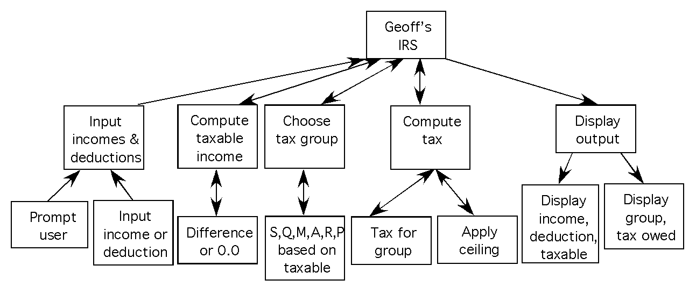

<!-- -------------------------------------------------------------------------------------- -->

<OL>
<LI> If you've looked down to the bottom of <A HREF="http://www.cs.miami.edu/~geoff/">my WWW
     page</A>, you might have noticed that <A HREF="https://github.quipo.life/SCUBA/">
     I used to do a lot of SCUBA diving</A>.
     On shallow dives (up to about 90') I put normal air in my tanks.
     For deeper dives I used
     <A HREF="https://www.padi.com/courses/enriched-air-diver">Nitrox</A> (also known as EANx).
     Air has about <A HREF="http://mistupid.com/chemistry/aircomp.htm">21% oxygen and 79%
     nitrogen</A>, while Nitrox varies from 21% oxygen and 79% nitrogen through to 40% oxygen and
     60% nitrogen.
     Using Nitrox allows you to stay down deeper for longer.
     However, when using Nitrox you have to take care not to use a mixture that is too strong,
     i.e., with a too high percentage of oxygen.
     This check is done using some simple mathematics:
     <UL>
     <LI> Find out how deep the dive will be, in feet.
     <LI> Decide on a mixture, i.e., the percentage of oxygen in the gas.
     <LI> Compute the ambient pressure for the dive.
          To do this you need to know the "feet per atmosphere" constant, which for ocean diving is 33.
          The ambient pressure is then the depth divided by the "feet per atmosphere" constant, plus 1.
     <LI> Compute the partial pressure of oxygen for the dive, equal to the fraction of oxygen
          (percentage divided by 100) in the gas multiplied by the ambient pressure.
          The recommended maximal partial pressure of oxygen is 1.4, and the contingency maximal
          partial pressure of oxygen is 1.6.
          If the computed partial pressure of oxygen for the dive exceeds these, I know the
          mixture is too strong.
     <LI> Additionally, I compute an "oxygen pressure group" (for those who are divers, this is
          not the same as the nitrogen pressure group).
          The oxygen pressure group is an uppercase letter representing the partial pressure of
          oxygen for the dive.
          'A' represents a partial pressure of oxygen from 0.0 to less than 0.1,
          'B' represents a partial pressure of oxygen from 0.1 to less than 0.2,
          'C' represents a partial pressure of oxygen from 0.2 to less than 0.3,
          etc.
          If the oxygen pressure group is 'N' I know I'm close to the oxygen pressure limit of
          1.4, and if it's a letter after 'N' I know the mixture is too strong.
     </UL>
     I'd like you to write me a C program in <TT>SCUBAO2.c</TT> to do these calculations for me.
     You'll have to get the depth and percentage oxygen in the gas as keyboard input - both will
     be integers.
     The output must provide the ambient pressure for the dive, the partial pressure of oxygen for
     the dive, and the oxygen pressure group.
     Additionally, it must output <TT>true</TT>/<TT>false</TT> status values indicating whether or
     not the dive will exceed the recommended maximal and contingency maximal values for partial
     pressure of oxygen.
     Here's what a sample run should look like (with the keyboard input shown 
     in italics) ...
<PRE>
Enter depth and percentage O2   : <EM>99 36</EM>
Ambient pressure                : 4.0
O2 pressure                     : 1.44
O2 group                        : O
Exceeds maximal O2 pressure     : true
Exceeds contingency O2 pressure : false
</PRE>
     The program must use functions appropriately. 
     As usual, ChatGPT can solve this, the solution sucks, and you must produce perfection to get 
     the mark.
     (1.0%)
<LI> Ahhh, tax time again. 
     Millions of innocent Americans are filling in their <A HREF="http://www.irs.gov/pub/irs-pdf/f1040.pdf">1040</A>.
     Don't we all just love the <A HREF="http://www.irs.gov/">IRS</A>.
     If I were king, things would be a whole bunch simpler, with a simple computer program to compute tax.
     Here's how Geoff's IRS program will work:
     <UL>
     <LI> The loyal subject is repeated prompted to enter either an amount of income (a positive value) or an amount of deduction (a negative value).
          This continues until a zero value is entered.
          The positive values are summed to form the <EM>income</EM>, and the negative values aresummed to form the <EM>deduction</EM>.
     <LI> The <EM>taxable income</EM> is computed as the income less the deduction, except in the case that the deduction is greater
          than than the income in which case the taxable income is zero.
     <LI> A <EM>tax group</EM> is calculated from the taxable income:
          <UL>
          <LI> Greater or equal to $500000 = Stinking rich
          <LI> Greater or equal to $200000 = Quite rich
          <LI> Greater or equal to $100000 = Miami poor
          <LI> Greater or equal to $50000  = Average
          <LI> Greater or equal to $20000  = Realistic
          <LI> Less than $20000 = Poor
          </UL>
          The tax group is saved as an uppercase letter, one of S, Q, M, A, R, P.
     <LI> The <EM>tax</EM> is computed using one of three rates:
          <UL>
          <LI> The stinking rich and quite rich get taxed at the high rate of 25%.
          <LI> The Miami poor get taxed at the medium rate of 10%.
          <LI> The average and realistic get taxed at the low rate of 3%.
          <LI> The poor pay no tax.
          </UL>
          Additionally, the maximal tax is $50000.
     <LI> The tax information is displayed.
     </UL>
     Here's what a sample run should look like (with the keyboard input shown 
     in italics) ...
<PRE>
Enter next amount : <EM>125000</EM>
Enter next amount : <EM>-250</EM>
Enter next amount : <EM>-3000</EM>
Enter next amount : <EM>15000</EM>
Enter next amount : <EM>88000</EM>
Enter next amount : <EM>-200</EM>
Enter next amount : <EM>0</EM> 
Income         = $228000.00
Deductions     = $  3450.00
Taxable Income = $224550.00
Tax group      = Q
Tax owed       = $ 50000.00
</PRE>
     Luckily, someone has already done the analysis and design, resulting in the following
     structure chart and algorithm ...
     

     
     

<PRE>
1. Input income and deduction
   1.1 Repeatedly until 0.0 is entered
       1.1.1 Prompt user
       1.1.2 Input value
       1.1.3 If positive 
             1.1.3.1 Add to income
       1.1.4 If negative 
             1.1.4.1 Add (absolute) to deduction
2. Compute taxable income
   2.1 If income >= deduction taxable is income - deduction, else 
   2.2 Taxable is 0.0
3. Compute tax group
   3.1 If taxable >= 500000
       3.1.1 Group is S, else
   3.2 If taxable >= 200000
       3.2.1 Group is Q, else
   3.3 If taxable >= 100000
       3.3.1 Group is M, else
   3.4 If taxable >= 50000
       3.4.1 Group is A, else
   3.5 If taxable >= 20000
       3.5.1 Group is R, else
   3.6 Group is P
4. Compute tax
   4.1 Depending on the group
       4.1.1 For S and Q
             4.1.1.1 Tax is 25% of taxable
       4.1.2 For M
             4.1.2.1 Tax is 10% of taxable
       4.1.3 For A and R
             4.1.3.1 Tax is 3% of taxable
       4.1.4 For P
             4.1.4.1 Tax is 0.0
       4.1.5 For other groups
             4.1.5.1 Error!
   4.2 If tax > 50000 then
       4.2.1 tax = 50000
5. Display tax information
   5.1 Display income
   5.2 Display deduction
   5.3 Display taxable
   5.4 Display group
   5.5 Display tax
</PRE>

     You must implement the program in C in <TT>GeoffsIRS.c</TT>.
     Internal nodes of the structure chart must be implemented as separate functions.
     The implementation must follow the design.
     </UL>
     

     As usual, ChatGPT can solve this, the solution sucks, and you must produce perfection to get the mark.
     (1.0%)
</OL>

<!-- -------------------------------------------------------------------------------------- -->
